# Cooking Simulator

   
  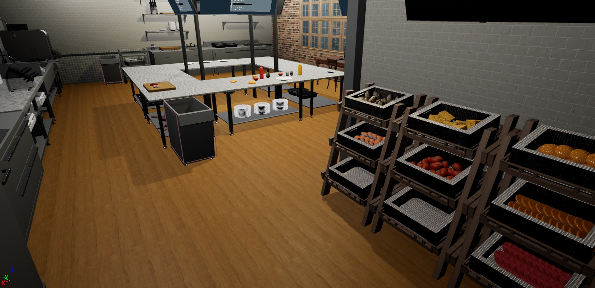
   

목차

1. 프로젝트 개요
2. 진행한 작업
3. 느낀점

## 1. 프로젝트 소개

<table>
  <tr>
    <td style="width: 30%; vertical-align: top;">
      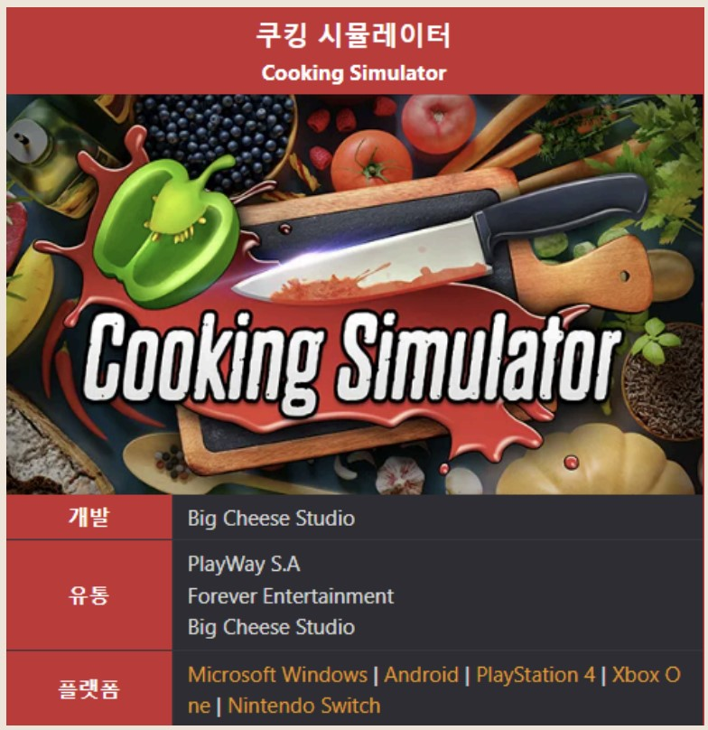
    </td>
    <td style="width: 70%; vertical-align: top; text-align: left;">
      <h3>프로젝트 개요/동기</h3>
      <ul>
        <li>VR게임인 쿠킹 시뮬레이터를 모작으로 3주간 3인으로 진행한 프로젝트</li>
		<li>랜덤으로 선택된 레시피에 따라 조리를 하여 완성된 요리를 제출하는 플로우의 게임</li>
		<li>학원에서 진행하는 프로젝트에서는 처음으로 C++위주로 진행된 프로젝트</li>
      </ul>
    </td>
  </tr>
</table>

## 기술 스택

|	GitHub	|UnrealEngine|	Blender		|	C++	|
| :------: 	| 	:------: |	:------: 	|:-----:|
| ![github]	| 	![ue]	 |		![bd]	|![c++]	|

 

## 2. 진행한 작업

- 전체적인 시스템
- 캐릭터 상호작용 기능
- 식재료관련 에셋(이미지, 매쉬 등) 준비
- 레시피 2개 중 1개 조리에 해당하는 플로우의 기능 준비
- 조리된 요리 납품 및 평가 기능
- 깃 관리

### 2-1. ItemInfoDataTable
<table>
  <tr>
    <td style="width: 30%; vertical-align: top;">
      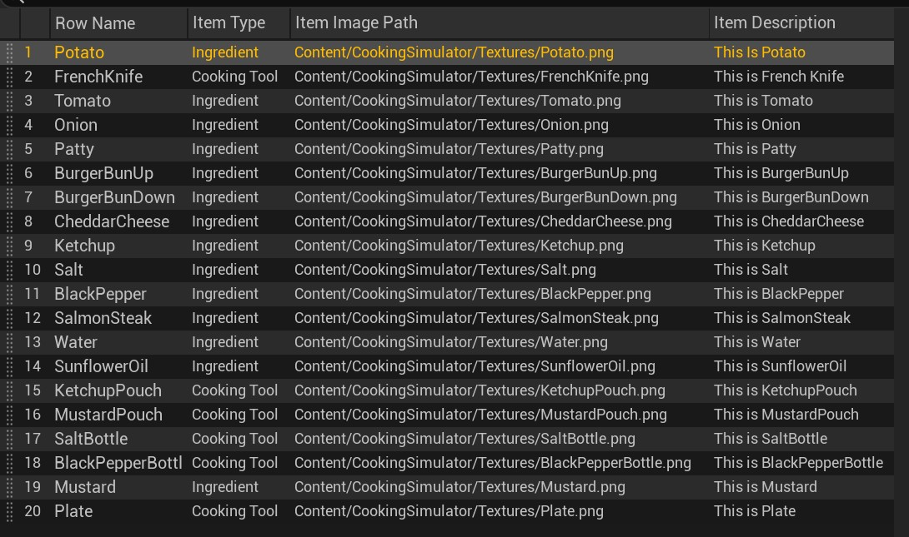
    </td>
    <td style="width: 70%; vertical-align: top; text-align: left;">
      <ul>
        <li>각 액터들의 기본적인 데이터를 초기화하는데 사용되는 데이터테이블</li>
      </ul>
    </td>
  </tr>
</table>

### 2-2. IngredientInfo
<table>
  <tr>
    <td style="width: 30%; vertical-align: top;">
      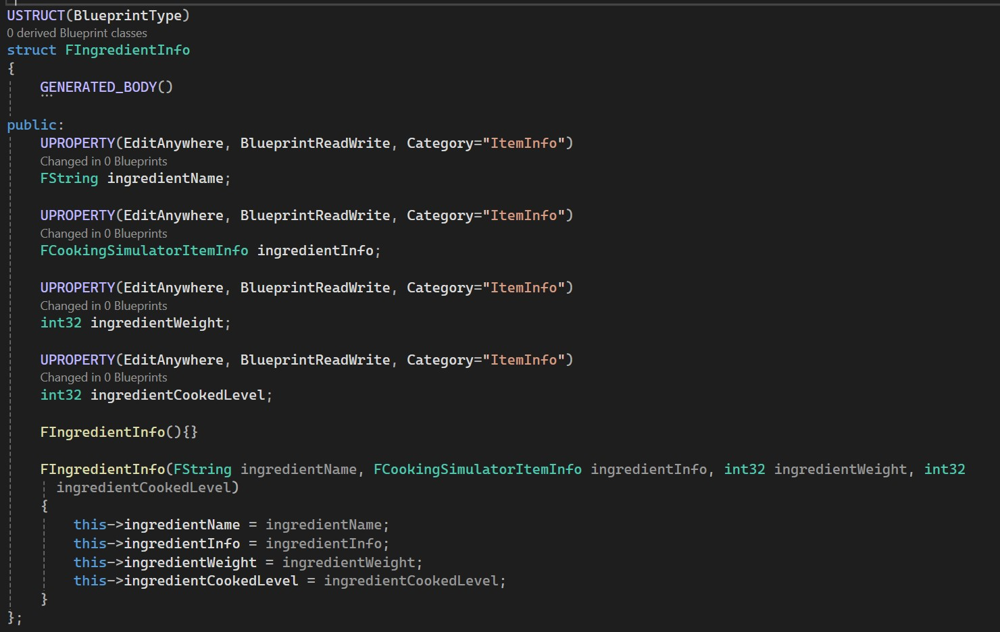
    </td>
    <td style="width: 70%; vertical-align: top; text-align: left;">
      <ul>
        <li>Ingredient형태의 아이템이 갖고있는 구조체</li>
		<li>ItemInfo에서 추가로 필요한 데이터 입력</li>
      </ul>
    </td>
  </tr>
</table>

### 2-3. 식재료 상위 클래스 기본기능
<table>
  <tr>
    <td style="width: 30%; vertical-align: top;">
      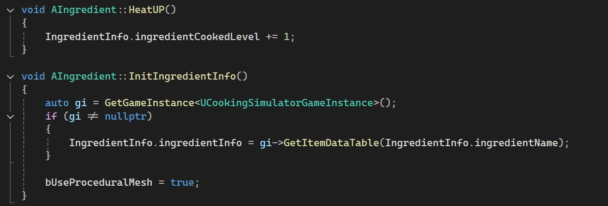
    </td>
    <td style="width: 70%; vertical-align: top; text-align: left;">
      <ul>
        <li>식재료들의 공통기능을 가진 상위 클래스</li>
		<li>IngredientInfo라는 구조체를 갖고있으며 데이터는 파생된 클래스에서 설정됨</li>
      </ul>
    </td>
  </tr>
</table>

### 2-4. RecipeSettingEx
<table>
  <tr>
    <td style="width: 30%; vertical-align: top;">
      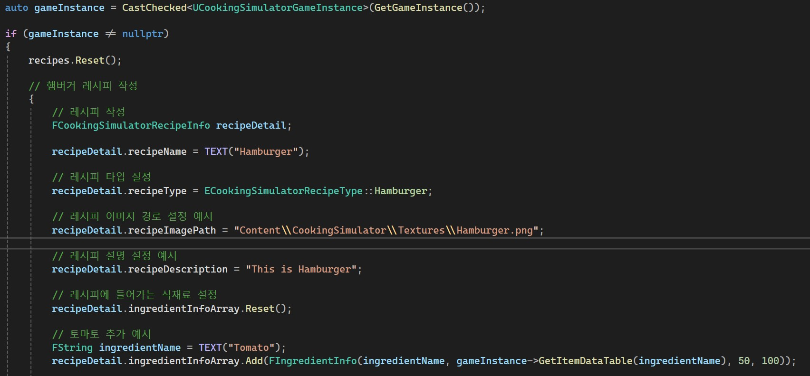
	  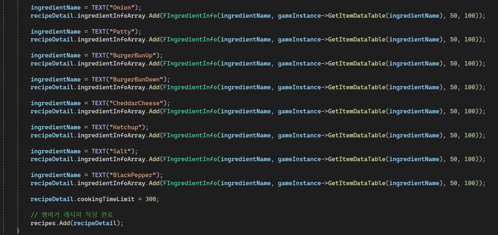
    </td>
  </tr>
  <tr>
    <td style="width: 70%; vertical-align: top; text-align: left;">
      <ul>
        <li>레퍼런스 레시피를 세팅하는 예시</li>
		<li>이후 해당 데이터를 통해 선택된 레시피의 가이드 출력</li>
      </ul>
    </td>
  </tr>
</table>

### 2-5. Sauce 기능
<table>
  <tr>
    <td style="width: 30%; vertical-align: top;">
      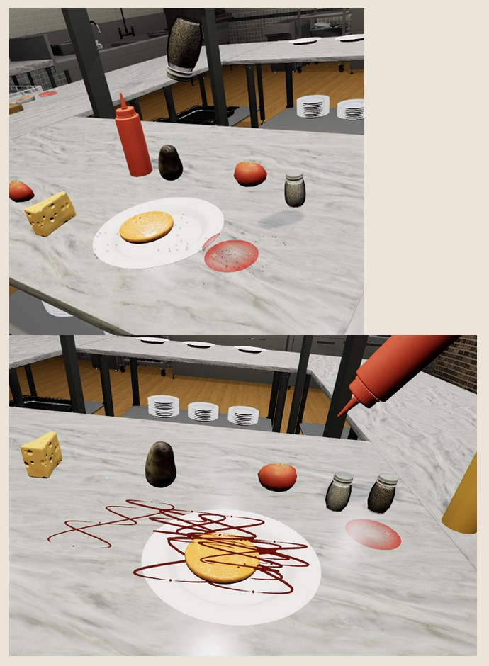
    </td>
    <td style="width: 70%; vertical-align: top; text-align: left;">
      <ul>
        <li>소금, 후추등은 작은 입자가 타겟 포인트의 주변 랜덤한 위치에 뿌려지는 기능으로 표현</li>
		<li>케첩, 머스타드는 곡선형태로 뿌려지는것을 스플라인 매쉬로 표현</li>
      </ul>
    </td>
  </tr>
</table>

### 2-6. KitchenTimer
<table>
  <tr>
    <td style="width: 30%; vertical-align: top;"> 
	  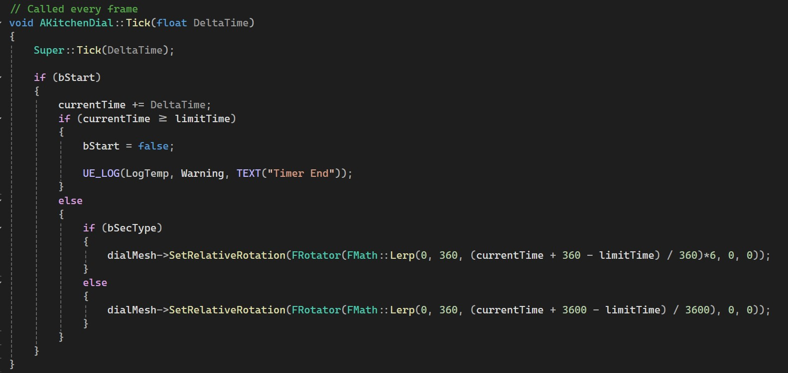
	  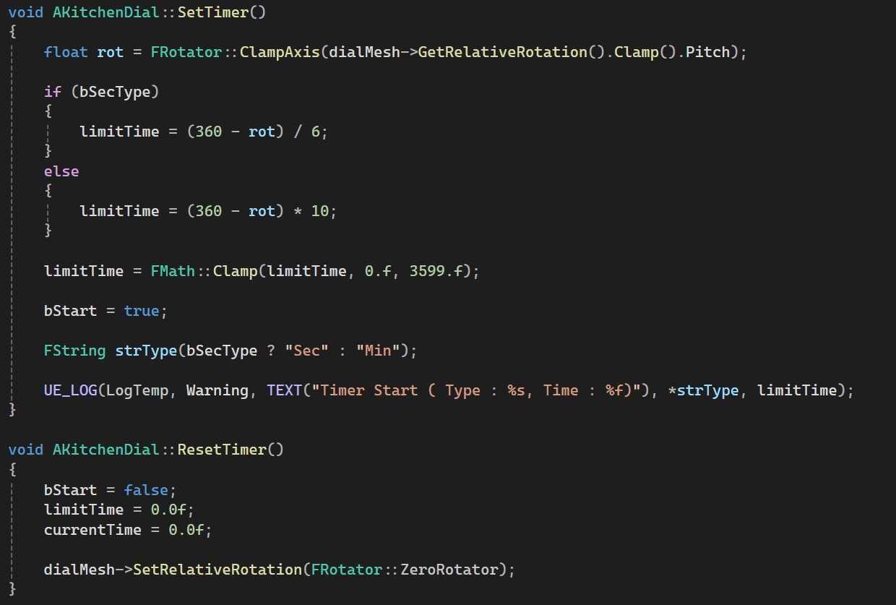
    </td>
  </tr>
  <tr>
    <td style="width: 70%; vertical-align: top; text-align: left;">
      <ul>
	    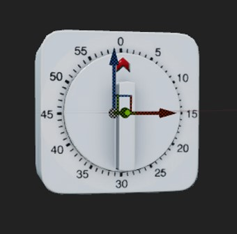
        <li>분단위 또는 시간단위로 변경하여 사용 가능한 타이머</li>
		<li>남은 시간을 붉은 화살표로 확인가능</li>
		<li>붉은 화살표가 0을 가르키게 되면 알람소리 발생</li>
      </ul>
    </td>
  </tr>
</table>

### 2-7. 조리기능
<table>
  <tr>
    <td style="width: 30%; vertical-align: top;">
      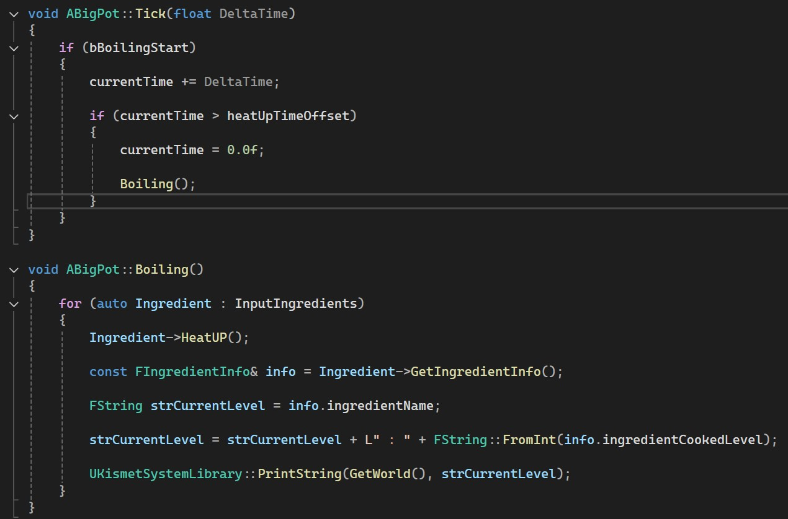
    </td>
    <td style="width: 70%; vertical-align: top; text-align: left;">
      <ul>
        <li>기능의 시작과 끝이 정해져있지 않은 타입의 조리도구</li>
		<li>내부에 있는 식재료들의 조리레벨을 Tick에따라 증가시키는 기능</li>
      </ul>
    </td>
  </tr>
</table>

### 2-8. DumbWaiter
<table>
  <tr>
    <td style="width: 30%; vertical-align: top;">
      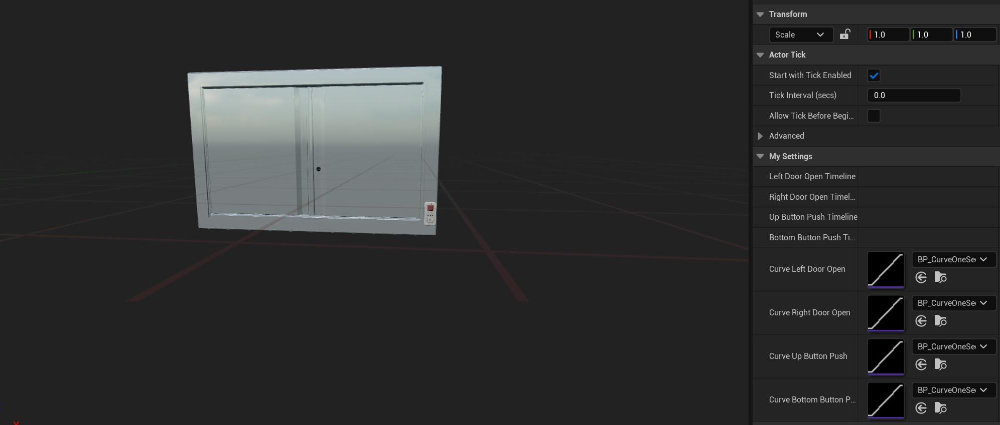
    </td>
    <td style="width: 70%; vertical-align: top; text-align: left;">
      <ul>
        <li>요리를 완료한 후 음식을 납품하는 액터</li>
		<li>우측하단에 2개의 버튼이 있고 상단의 Open버튼을 누르면 문이 열림</li>
		<li>하단의 Close버튼을 누르면 문이 닫히며 요리의 평가가 시작됨</li>
		<li>버튼이 눌렸을 때 들어가는 모션과 문이 열리는 모션은 Curve로 자연스럽게 처리를 시도</li>
      </ul>
    </td>
  </tr>
</table>

### 2-9. CompareDeliveryFood
<table>
  <tr>
    <td style="width: 30%; vertical-align: top;">
      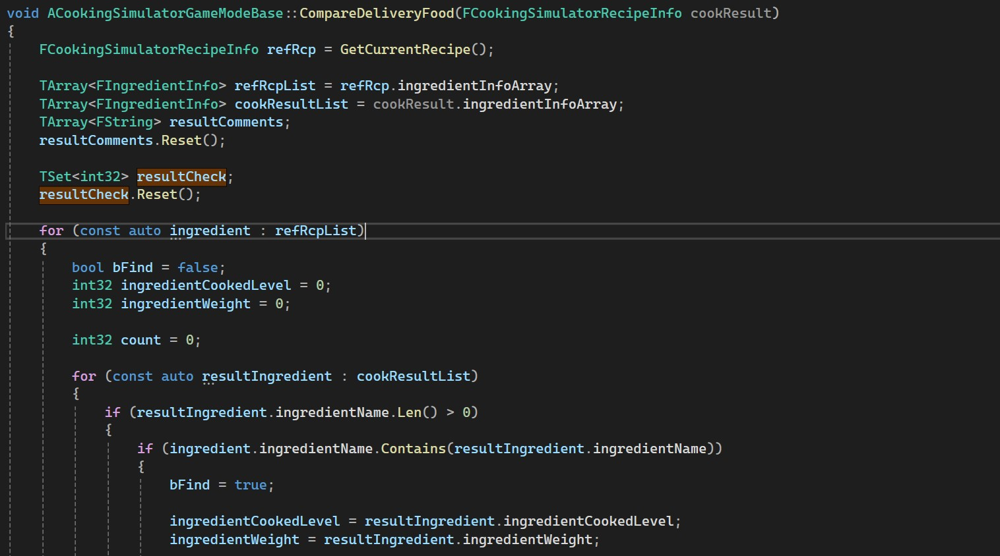
	  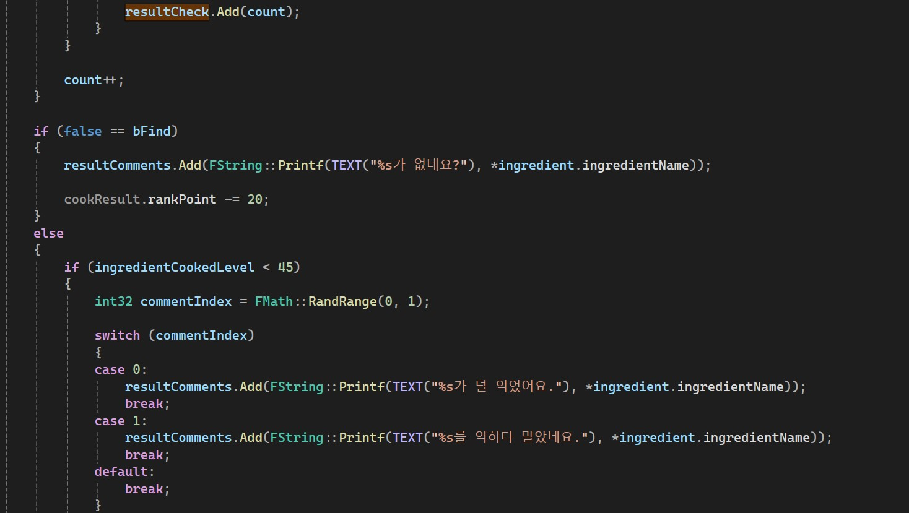
	  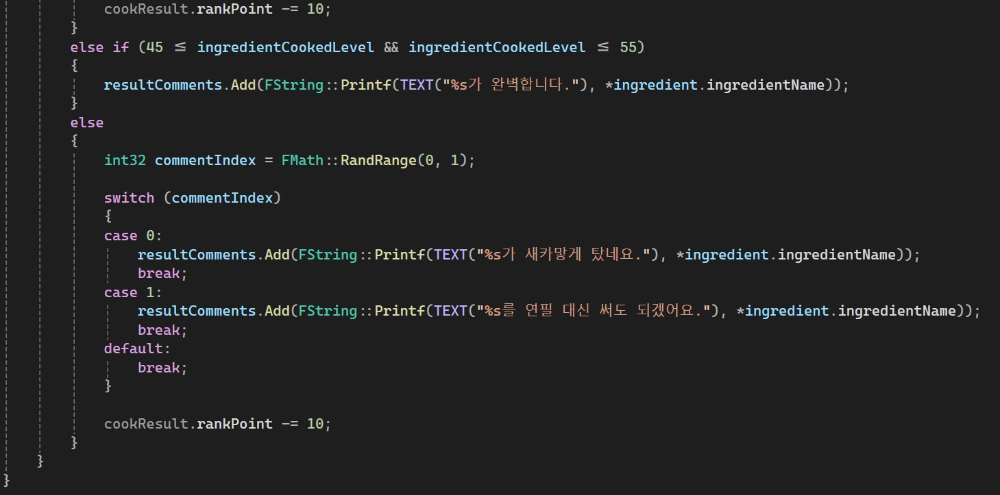
	  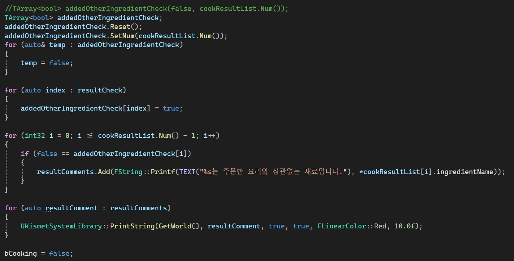
	  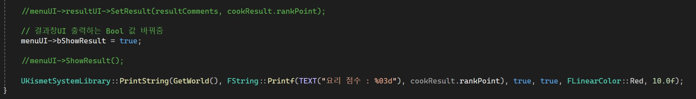
    </td>
  </tr>
  <tr>
    <td style="width: 70%; vertical-align: top; text-align: left;">
      <ul>
        <li>게임모드에 설정된 타겟 레시피와 완성된 요리를 비교</li>
		<li>Plate라는 액터에 자식액터 형태로 부착된 식재료들을 분리하여 각 식재료들의 이름과 조리상태를 분석</li>
		<li>조리 상태에 따라 점수 가감 및 코맨트 출력</li>
		<li>레시피와 상관없는 식재료가 들어있는 경우 점수감점 및 코맨트 출력</li>
		<li>요리 성공 및 실패 출력</li>
      </ul>
    </td>
  </tr>
</table>

### 2-10. 깃 관리
<table>
  <tr>
    <td style="width: 30%; vertical-align: top;">
      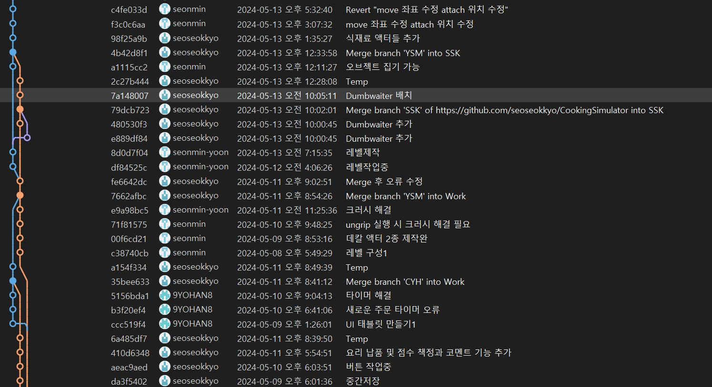
    </td>
  </tr>
  <tr>
    <td style="width: 70%; vertical-align: top; text-align: left;">
      <ul>
        <li>선호하는 깃 관리방식인 Release(master/main)/Work(최신)/Worker1/Worker2....방식으로 관리</li>
      </ul>
    </td>
  </tr>
</table>

 

## 3. 느낀점

- 역시 블루프린트 기반보다는 C++기반이 훨씬 협업, 관리가 수월하다는것을 체감

- 언리얼 엔진이 일반적으로 생각 가능한 필요기능들은 대부분 갖추고 있다는것을 느끼게 된 프로젝트

- VR을 살면서 아예 처음 접한 시점인데 작업, 테스트 모두 VR멀미로 인해 상당히 고통스러웠던 프로젝트

- VR하드웨어가 어서 발전했으면 좋겠음

 

## 라이센스

MIT &copy; [NoHack](mailto:lbjp114@gmail.com)

<!-- Stack Icon Refernces -->

[git]: /images/stack/Git.svg
[github]: /images/stack/GithubDesktop.svg
[ue]: /images/stack/UnrealEngine.svg
[bd]: /images/stack/Blender.svg
[c++]: /images/stack/C++.svg
[mfc]: /images/stack/Microsoft_Foundation_Class.svg
